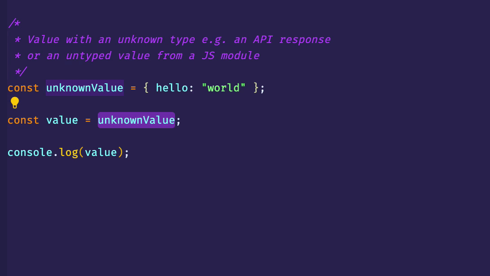
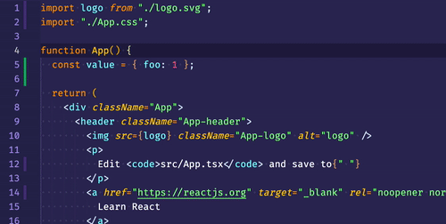

# Typehole 🕳

<p></p>

Automatically generate TypeScript types and interfaces for all serializable runtime values.

Typehole is a TypeScript development tool for Visual Studio Code that helps you automate creating the initial static typing for runtime values.

<br/>
<br/>



### How does it work?

1. Find an `any` / `unknown` value you need an interface for

```ts
const response = await axios.get("https://reddit.com/r/videos.json");
const data = response.data;
```

2. Place the value inside a typehole

```ts
const data = typehole.t(response.data);
```

3. Run your code either in a browser or in Node.js. Typehole runtime captures the value and sends it back to your code editor. The VSCode extension records the captured value, turns all the values from that typehole into an interface and inserts it into the same module.

```ts
interface RedditResponse {
  /* ✨ Actual fields and types are automatically generated ✨ */
}

const response = await axios.get("https://reddit.com/r/videos.json");
const data: RedditResponse = typehole.t(response.data);
```

3. Remove the typehole, and you're done. Typeholes are meant to be development-time only, so you shouldn't commit them.

```ts
interface RedditResponse {
  /* ✨ Actual fields and types are automatically generated ✨ */
}

const response = await axios.get("https://reddit.com/r/videos.json");
const data: RedditResponse = response.data;
```

This plugin is still very experimental, so please expect and report issues.

## Features

- Generate TypeScript types from runtime values
- Augment your types by providing more runtime values<br/><br/>

- Wrap values automatically to typeholes with a code action<br/><br/>

### Values that can be automatically typed

All primitive values and values that are JSON serializable.

- Booleans
- Numbers
- Strings
- Arrays
- Objects
- null

So all values you can receive as an HTTP request payload can be turned into an interface.

All other values (promises, functions etc.) will be typed as `any`.

## Commands


- Starting and stopping the server manually isn't necessary by default. The server starts once you add your first typehole.

## Extension Settings

At this stage, there are no configuration options available.

## Known Issues

- Typehole server cannot be running in 2 VSCode editors at the same time as the server port is hard-coded to 17341

- Mixed top level runtime types such as `[{"a":3}, 2]` are transformed into `any[]` because of limitations in [json-ts library](https://github.com/shakyShane/json-ts/blob/master/src/transformer.ts#L202)

## Release Notes

## [Unreleased]

## [1.4.1] - 2021-05-09

### Fixed

- Unserializable diagnostic now shown only once per typehole. Previously the tooltip could have the same warning multiple times.

- Server is now stopped once all typeholes are removed. Restarting the server now also works

### Added

## [1.4.0] - 2021-05-09

### Added

- Sample collection. Provide multiple different values to a typehole and the generated type gets refined based on them.

## [1.3.0] - 2021-05-08

### Added

- Configuration options for project path, package manager and if runtime should be automatically installed

## [1.1.0] - 2021-05-08

### Added

- Automatic PascalCase transformation for all generated interface and type alias names

---

**Enjoy!**
