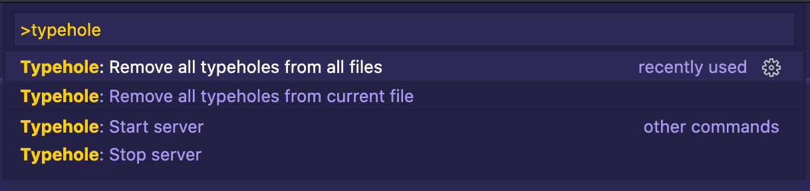

# Typehole 🕳

Automatically generate TypeScript types and interfaces for all serializable runtime values.

Typehole is a TypeScript development tool for Visual Studio Code that helps you automate creating the initial static typing for runtime values.


### How does it work?

1. Find something you need an interface for

```ts
const response = await axios.get("https://reddit.com/r/videos.json");
const data = response.data;
```

2. Add a typehole around the value with an unknown type

```ts
const data = typehole.t(response.data);
```

3. Run your code (either in a browser or with Node.js), and Typehole takes care of the rest

```ts
interface RedditResponse {
  /* ✨ Actual fields and types are automatically generated ✨ */
}

const response = await axios.get("https://reddit.com/r/videos.json");
const data: RedditResponse = typehole.t(response.data);
```

3. Remove the typehole, and you're good to go. Typeholes are meant to be development-time only, so you shouldn't commit them.

```ts
interface RedditResponse {
  /* ✨ Actual fields and types are automatically generated ✨ */
}

const response = await axios.get("https://reddit.com/r/videos.json");
const data: RedditResponse = response.data;
```

This plugin is still very experimental, so please expect and report issues.

## Features

- Generate TypeScript types from runtime values
- Wrap values automatically to typeholes with a code action<br/>

### Values that can be automatically typed

All primitive values and values that are JSON serializable.

- Booleans
- Numbers
- Strings
- Arrays
- Objects
- null

So all values you can receive as an HTTP request payload can be turned into an interface.

All other values (promises, functions etc.) will be typed as `any`.

## Commands



- Starting and stopping the server manually isn't necessary by default. The server starts once you add your first typehole.

## Extension Settings

At this stage, there are no configuration options available.

## Known Issues

- Typehole server cannot be running in 2 VSCode editors at the same time as the server port is hard-coded to 17341

## Release Notes

### 0.0.1

The initial release of Typehole.

---

**Enjoy!**
